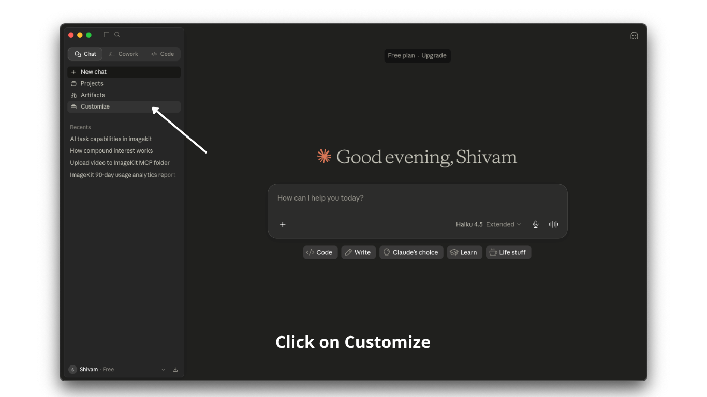
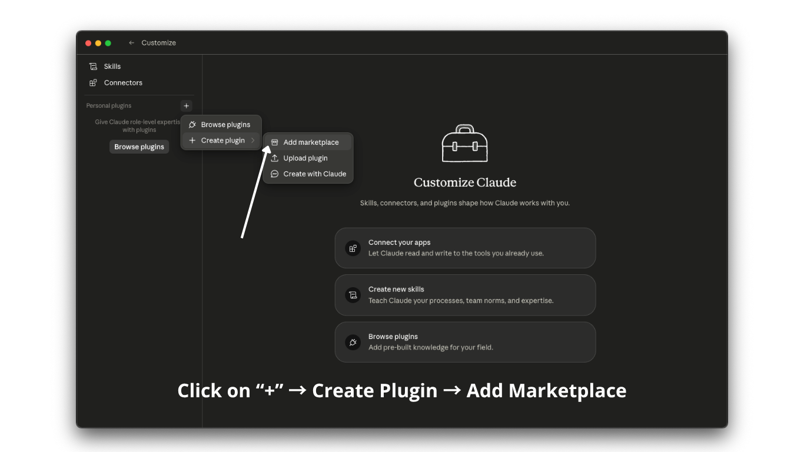
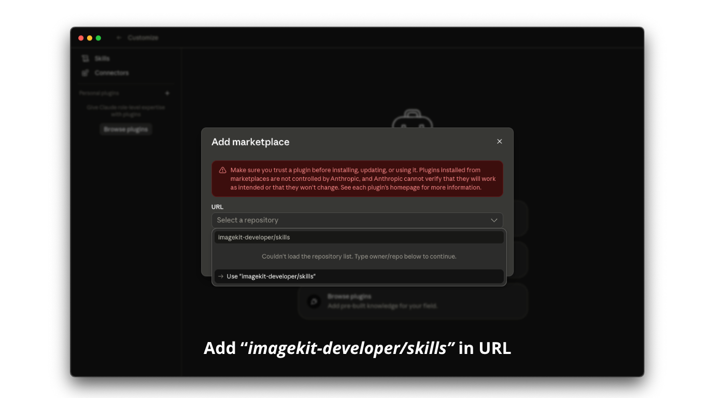
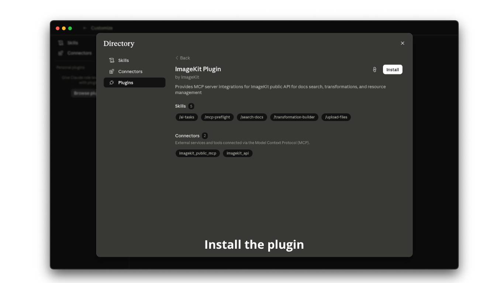
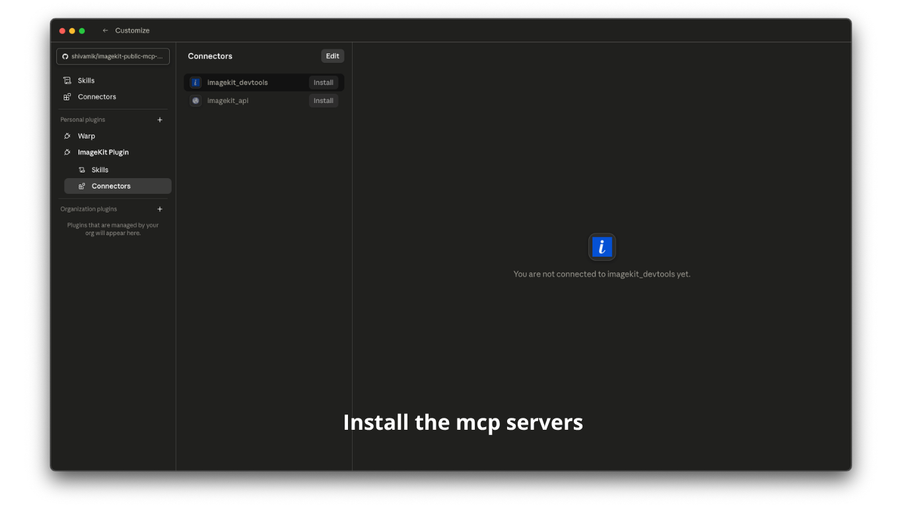
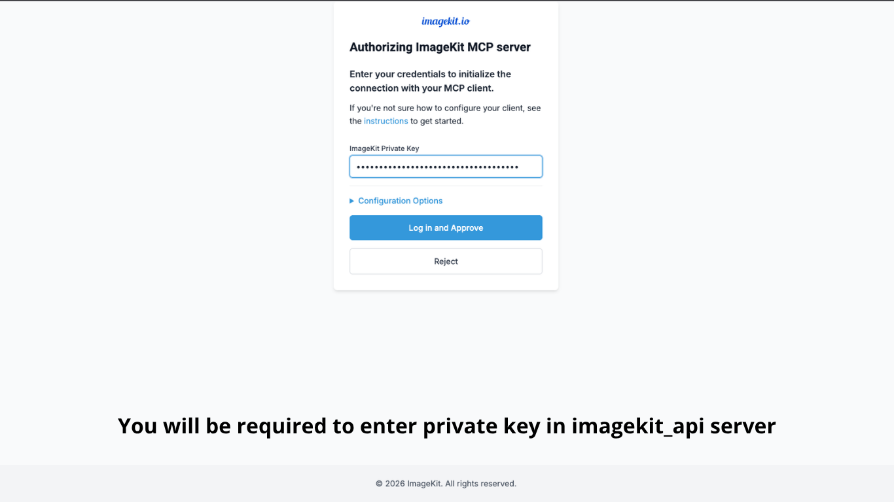
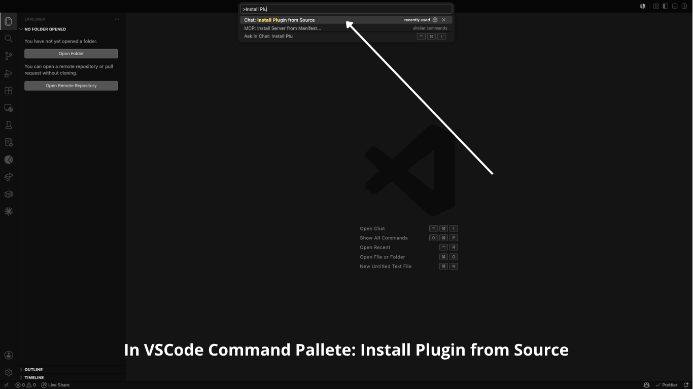
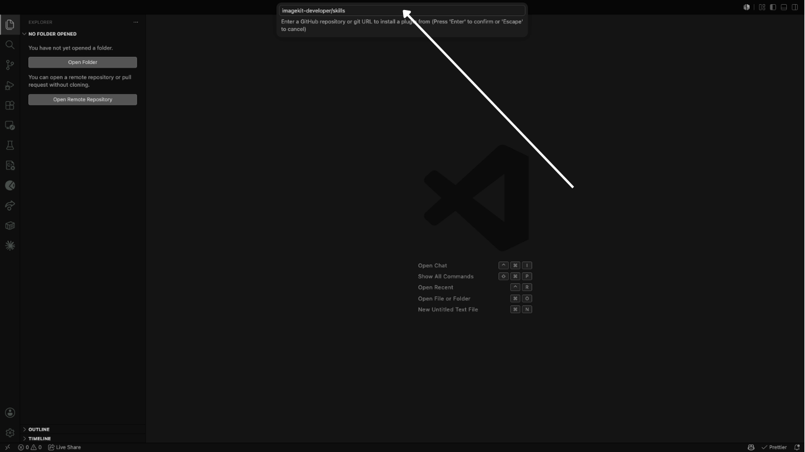

# ImageKit Skills

[](https://skills.sh/imagekit-developer/skills)

Reusable AI agent skills for [ImageKit.io](https://imagekit.io) — install them with the `skills` CLI to enhance your coding agent's capabilities.

## Skills

| Skill | Description |
|-------|-------------|
| **mcp-preflight** | Mandatory routing guide — tells the agent which MCP server to call for what, before every ImageKit tool invocation |
| **search-docs** | Search ImageKit documentation with optimized queries and source selection |
| **transformation-builder** | Build ImageKit image/video transformations — AI editing, background removal, resize, crop, overlays, and more |
| **upload-files** | Upload files to ImageKit media library with folder paths, tags, and metadata |
| **ai-tasks** | Apply AI-powered analysis to images for business-specific tagging, metadata extraction, and quality checks using controlled vocabularies |

## Installation

You can install skills and MCP servers using either method:

- **Plugin Method (Recommended)**: Use the ImageKit plugin for your platform for guided, one-click setup of skills and MCP servers
- **Manual Method**: Install skills via CLI and add MCP servers through configuration files

Choose the method that works best for your workflow. Below, each platform shows both options.

### Claude

#### Plugin Method (Recommended)

Follow these steps to install the ImageKit plugin in Claude Code:

1. **Open Plugin Settings** — Click on **Customize** in the left sidebar
   

2. **Add Marketplace** — Click the **"+"** button and select **Create Plugin** → **Add Marketplace**
   

3. **Enter Plugin URL** — Add `imagekit-developer/skills` in the marketplace URL field
   

4. **Install Plugin** — Find and install the ImageKit Skills plugin
   

5. **Install MCP Servers** — Click on **Connectors** in the installed plugin and install the MCP servers (`imagekit_devtools` and `imagekit_api`)
   

6. **Complete Authentication** — Complete authentication for the `imagekit_api` server when prompted
   

Once complete, all ImageKit skills and MCP servers are ready to use in Claude Code.

#### Manual Method

**Install Skills**

```bash
npx skills add imagekit-developer/skills --all
```

Run the following command in your terminal:

```bash
claude mcp add imagekit_devtools --transport http https://devtools-mcp.imagekit.io/mcp
claude mcp add imagekit_api --transport http https://api-mcp.imagekit.in/mcp
```

Or edit your Claude Desktop configuration file:
- **macOS**: `~/Library/Application Support/Claude/claude_desktop_config.json`
- **Windows**: `%APPDATA%\Claude\claude_desktop_config.json`

```json
{
  "mcpServers": {
    "imagekit_devtools": {
      "command": "npx",
      "args": ["-y", "mcp-remote@latest", "https://devtools-mcp.imagekit.io/mcp"]
    },
    "imagekit_api": {
      "command": "npx",
      "args": ["-y", "mcp-remote@latest", "https://api-mcp.imagekit.in/mcp"]
    }
  }
}
```

> **Note:** Restart Claude Desktop / ClaudeCode after making changes for the MCP servers to take effect.

### Codex

Install Skills

```bash
npx skills add imagekit-developer/skills --all
```

Add MCP servers via CLI:

```bash
codex mcp add imagekit_devtools --url https://devtools-mcp.imagekit.io/mcp
codex mcp add imagekit_api --url https://api-mcp.imagekit.in/mcp
```

Or edit `~/.codex/config.toml` directly:

```toml
[mcp_servers.imagekit_devtools]
url = "https://devtools-mcp.imagekit.io/mcp"

[mcp_servers.imagekit_api]
url = "https://api-mcp.imagekit.in/mcp"
```

> **Note:** Restart Codex after adding MCP servers for them to take effect.

### VS Code Copilot

#### Plugin Method (Recommended)

Follow these steps to install the ImageKit plugin in VS Code:

1. **Open Command Palette** — Press `⇧⌘P` and run **Install Plugin from Source**
   

2. **Add Plugin Repository** — Enter `imagekit-developer/skills` in the plugin source field
   

3. **Complete Installation** — Continue with the installation process as prompted

4. **Restart VS Code** — Restart VS Code for all skills and MCP servers to take effect

Once complete, all ImageKit skills and MCP servers are ready to use in VS Code.

#### Manual Method

**Install Skills**

```bash
npx skills add imagekit-developer/skills --all
```

Install MCP servers via the command line:

```bash
code --add-mcp "{\"name\":\"imagekit_devtools\",\"type\":\"http\",\"url\":\"https://devtools-mcp.imagekit.io/mcp\"}"
code --add-mcp "{\"name\":\"imagekit_api\",\"type\":\"http\",\"url\":\"https://api-mcp.imagekit.in/mcp\"}"
```

Or install via the VS Code UI:

1. Open the Command Palette (`⇧⌘P`) and run **MCP: Add Server**
2. Select **HTTP (http or Server Sent Event)** as the server type
3. Enter the server URL when prompted:
   - Imagekit DevTools MCP: `https://devtools-mcp.imagekit.io/mcp`
   - Imagekit API MCP: `https://api-mcp.imagekit.in/mcp`
4. Enter the server name (`imagekit_devtools` or `imagekit_api`)

> **Note:** Restart VS Code after adding MCP servers for them to take effect.

### Cursor

Install Skills

```bash
npx skills add imagekit-developer/skills --all
```

Add MCP server via these buttons
1. Install DevTools MCP Server [](https://cursor.com/en-US/install-mcp?name=imagekit_devtools&config=eyJ1cmwiOiJodHRwczovL2RldnRvb2xzLW1jcC5pbWFnZWtpdC5pby9tY3AifQ%3D%3D)

2. Install API MCP Server [](https://cursor.com/en-US/install-mcp?name=imagekit_api&config=eyJ1cmwiOiJodHRwczovL2FwaS1tY3AuaW1hZ2VraXQuaW4vbWNwIn0%3D)


Or edit your Cursor MCP configuration at `~/.cursor/mcp.json`:

```json
{
  "mcpServers": {
    "imagekit_devtools": {
        "url": "https://devtools-mcp.imagekit.io/mcp"
    },
    "imagekit_api": {
        "url": "https://api-mcp.imagekit.in/mcp"
    }
  }
}
```

> **Note:** Restart Cursor after adding MCP servers for them to take effect.

### Windsurf

```bash
npx skills add imagekit-developer/skills --all
```


Or edit your Windsurf configuration at `~/.codeium/windsurf/mcp_config.json`:

```json
{
  "mcpServers": {
    "imagekit_devtools": {
        "url": "https://devtools-mcp.imagekit.io/mcp"
    },
    "imagekit_api": {
        "url": "https://api-mcp.imagekit.in/mcp"
    }
  }
}
```

> **Note:** Restart Windsurf after adding MCP servers for them to take effect.

## Usage

Once installed, these skills are automatically available to your AI agent. The agent will consult the relevant skill before performing ImageKit operations, ensuring correct tool usage and better results.

## License

MIT
